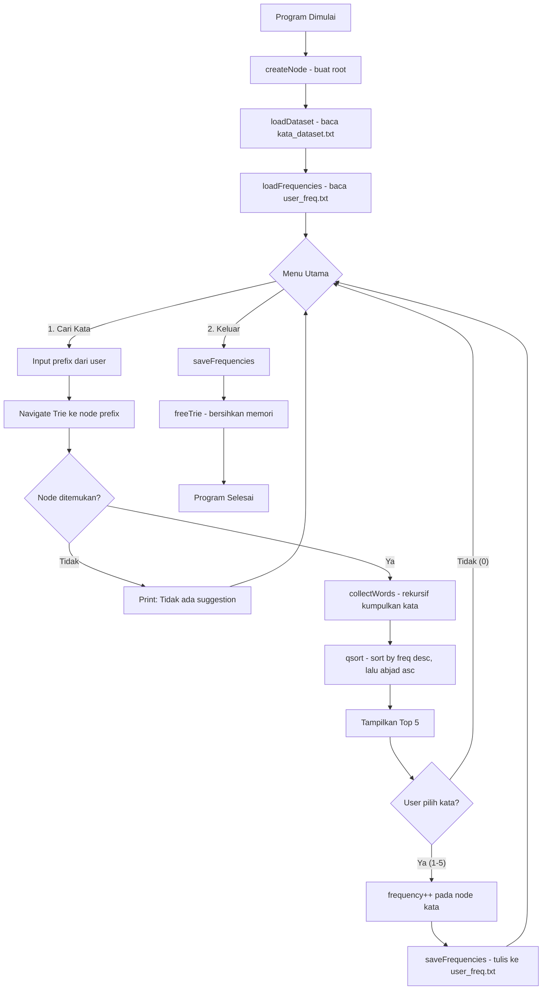

# 🧭 Panduan Lengkap: Aplikasi Autosuggestion dengan Trie (Bahasa C)

> [!IMPORTANT]
> Panduan ini dirancang agar **kamu menulis sendiri semua kode**. Tidak ada kode jadi — hanya penjelasan konsep, pseudocode, dan petunjuk langkah demi langkah.

---

## 📋 Daftar Isi

1. [Gambaran Besar Aplikasi](#1-gambaran-besar-aplikasi)
2. [Struktur Folder & File](#2-struktur-folder--file)
3. [Persiapan Dataset](#3-persiapan-dataset)
4. [FASE 1: Header File (`trie.h`)](#4-fase-1-header-file-trieh)
5. [FASE 2: Implementasi Trie (`trie.c`)](#5-fase-2-implementasi-trie-triec)
6. [FASE 3: Program Utama (`main.c`)](#6-fase-3-program-utama-mainc)
7. [FASE 4: Kompilasi & Testing](#7-fase-4-kompilasi--testing)
8. [Alur Kerja Program (Flowchart)](#8-alur-kerja-program-flowchart)
9. [Checklist Progress](#9-checklist-progress)

---

## 1. Gambaran Besar Aplikasi

### Apa yang dilakukan aplikasi ini?
1. User mengetik **prefix** (huruf awal), misal: `"mem"`
2. Aplikasi menampilkan **5 kata terbaik** yang diawali prefix tersebut
3. Kriteria "terbaik":
   - **Frekuensi tertinggi** (kata yang paling sering dipilih user)
   - Jika frekuensi sama → **urutan abjad (leksikografik) terendah**
4. User bisa **memilih** salah satu suggestion → frekuensi kata itu bertambah
5. Frekuensi **tersimpan di file** → tidak hilang walau program ditutup

### Struktur Data yang Dipakai
- **Trie** → menyimpan semua kata dari dataset & memungkinkan prefix search yang efisien O(n)
- Setiap node akhir kata menyimpan **frequency counter**

---

## 2. Struktur Folder & File

Buat struktur folder seperti ini di dalam folder project kamu:

```
TUGAS BESAR SDA PR Autosuggestion/
├── trie.h              ← Deklarasi struct & prototype fungsi
├── trie.c              ← Implementasi semua fungsi Trie
├── main.c              ← Program utama (menu, input user)
├── kata_dataset.txt    ← Dataset kata (hasil konversi dari CSV)
└── user_freq.txt       ← File penyimpanan frekuensi user (dibuat otomatis oleh program)
```

> [!NOTE]
> File `satu.c` yang sudah ada bisa kamu hapus atau rename. Kita akan pakai struktur multi-file agar lebih rapi.

---

## 3. Persiapan Dataset

### 3.1 Download dari Kaggle
Download dataset **IndoLeX** dari link yang kamu berikan. Kamu akan mendapat file CSV.

### 3.2 Dataset mana yang dipakai?
Dari dataset IndoLeX, ada 2 file:
- `IndoLeX_Database.csv` → berisi: `word,frequency,category,root,Definition`
- `IndoLeX_Root_Frequencies.csv` → berisi: `rank,word,frequency`

**Gunakan `IndoLeX_Root_Frequencies.csv`** karena lebih simpel — hanya berisi kata dan frekuensi.

### 3.3 Konversi ke format TXT sederhana
Program C kita akan membaca file **TXT** dengan format sederhana:

```
satu kata per baris (huruf kecil semua, tanpa spasi di dalam kata)
```

**Contoh isi `kata_dataset.txt`:**
```
ada
adalah
adik
air
akan
alam
anak
apa
ajar
baca
buat
...
```

**Cara konversi:** Buka file CSV di Excel/Notepad, ambil **hanya kolom `word`**, simpan sebagai `.txt` dengan satu kata per baris. Atau kamu bisa buat script Python kecil untuk mengekstrak kolom `word` saja.

> [!TIP]
> Untuk testing awal, kamu bisa buat `kata_dataset.txt` manual dulu dengan 20-30 kata bahasa Indonesia. Setelah program jalan, baru pakai dataset lengkap.

---

## 4. FASE 1: Header File (`trie.h`)

### 4.1 Tujuan file ini
File header berisi:
- Konstanta-konstanta
- Definisi struct
- Prototype (deklarasi) fungsi

### 4.2 Konstanta yang dibutuhkan

Kamu perlu mendefinisikan konstanta-konstanta berikut menggunakan `#define`:

| Nama Konstanta | Nilai | Fungsi |
|---|---|---|
| `ALPHABET_SIZE` | `26` | Jumlah huruf a-z |
| `MAX_WORD_LEN` | `100` | Panjang maksimum satu kata |
| `TOP_K` | `5` | Jumlah suggestion yang ditampilkan |
| `DATASET_FILE` | `"kata_dataset.txt"` | Nama file dataset |
| `FREQ_FILE` | `"user_freq.txt"` | Nama file penyimpanan frekuensi |

### 4.3 Struct `TrieNode`

Ini adalah inti dari Trie. Setiap node merepresentasikan **satu karakter** dalam pohon.

**Field yang harus ada di struct:**

| Field | Tipe | Fungsi |
|---|---|---|
| `children[ALPHABET_SIZE]` | `struct TrieNode*` array | Pointer ke 26 anak node (a-z) |
| `isEndOfWord` | `int` | Penanda apakah node ini akhir dari sebuah kata (0 = bukan, 1 = ya) |
| `frequency` | `int` | Berapa kali kata ini dipilih user (untuk sorting suggestion) |

> [!IMPORTANT]
> Perbedaan dari referensi GeeksforGeeks: kita **menambahkan field `frequency`**. Ini tidak ada di referensi asli karena referensi hanya demo insert/search biasa. Kita butuh ini untuk fitur autosuggestion berdasarkan popularitas.

### 4.4 Struct `Suggestion`

Struct pembantu untuk menyimpan hasil suggestion sementara sebelum di-sort.

| Field | Tipe | Fungsi |
|---|---|---|
| `word[MAX_WORD_LEN]` | `char` array | Kata hasil suggestion |
| `frequency` | `int` | Frekuensi kata tersebut |

### 4.5 Prototype Fungsi

Deklarasikan fungsi-fungsi berikut di header:

```
Fungsi Dasar Trie:
├── createNode()          → membuat TrieNode baru, return pointer
├── insert()              → masukkan kata ke Trie
└── search()              → cari kata exact di Trie, return pointer ke node akhir

Fungsi Autosuggestion:
├── collectWords()        → rekursif: kumpulkan semua kata dari suatu node ke bawah
├── autocomplete()        → cari semua kata berawalan prefix, tampilkan top-5
└── compareSuggestion()   → fungsi komparator untuk qsort()

Fungsi File I/O:
├── loadDataset()         → baca kata_dataset.txt, insert semua ke Trie
├── loadFrequencies()     → baca user_freq.txt, update frekuensi di Trie
├── saveFrequencies()     → simpan semua kata + frekuensi ke user_freq.txt
└── collectAllWords()     → rekursif: kumpulkan SEMUA kata di Trie (untuk save)

Fungsi Utilitas:
└── freeTrie()            → bebaskan memori seluruh Trie (rekursif)
```

### 4.6 Include Guard

Jangan lupa bungkus seluruh isi `trie.h` dengan include guard:

```
#ifndef TRIE_H
#define TRIE_H

... (semua isi header) ...

#endif
```

### 4.7 Header standar yang perlu di-include

Di dalam `trie.h`, include header-header ini:
- `<stdio.h>` → untuk FILE, printf, scanf
- `<stdlib.h>` → untuk malloc, free, qsort
- `<string.h>` → untuk strcpy, strcmp, strlen

---

## 5. FASE 2: Implementasi Trie (`trie.c`)

Di bagian paling atas file ini, include header kamu: `#include "trie.h"`

### 5.1 `createNode()` — Membuat Node Baru

**Apa yang dilakukan:**
1. Alokasi memori untuk satu `TrieNode` menggunakan `malloc`
2. Set `isEndOfWord` = 0
3. Set `frequency` = 0
4. Set semua `children[i]` = `NULL` (loop dari 0 sampai ALPHABET_SIZE-1)
5. Return pointer ke node baru

**Pseudocode:**
```
function createNode():
    node = malloc(sizeof TrieNode)
    node->isEndOfWord = 0
    node->frequency = 0
    for i = 0 to 25:
        node->children[i] = NULL
    return node
```

> [!WARNING]
> Selalu cek apakah `malloc` return `NULL` (memori habis). Kalau NULL, print error dan `exit(1)`.

---

### 5.2 `insert()` — Memasukkan Kata ke Trie

**Parameter:** `TrieNode *root`, `const char *word`

**Apa yang dilakukan:**
1. Mulai dari `root`
2. Untuk setiap karakter dalam `word`:
   - Hitung index = `karakter - 'a'` (sehingga 'a'=0, 'b'=1, ..., 'z'=25)
   - Kalau `children[index]` NULL → buat node baru dengan `createNode()`
   - Pindah curr ke `children[index]`
3. Di node terakhir, set `isEndOfWord` = 1

**Pseudocode:**
```
function insert(root, word):
    curr = root
    for each char c in word:
        index = c - 'a'
        if curr->children[index] == NULL:
            curr->children[index] = createNode()
        curr = curr->children[index]
    curr->isEndOfWord = 1
```

> [!TIP]
> Ini **persis sama** dengan kode C di referensi GeeksforGeeks yang kamu berikan. Bedanya kita pakai bahasa C murni (bukan C++), jadi pakai `while (*word)` atau `for` loop biasa untuk iterasi string.

---

### 5.3 `search()` — Mencari Kata di Trie

**Parameter:** `TrieNode *root`, `const char *word`  
**Return:** `TrieNode*` (pointer ke node akhir kata) atau `NULL` jika tidak ditemukan

**Apa yang dilakukan:**
1. Mulai dari `root`
2. Untuk setiap karakter dalam `word`:
   - Hitung index
   - Kalau `children[index]` NULL → return NULL (kata tidak ada)
   - Pindah ke `children[index]`
3. Kalau `isEndOfWord` == 1 → return pointer node ini
4. Kalau `isEndOfWord` == 0 → return NULL (prefix ada tapi bukan kata utuh)

> [!NOTE]
> Kenapa return `TrieNode*` dan bukan `int`? Karena kita perlu akses ke node-nya untuk membaca/mengubah `frequency`. Di referensi GeeksforGeeks return `bool`, tapi kita modifikasi supaya lebih berguna.

---

### 5.4 `compareSuggestion()` — Komparator untuk Sorting

**Parameter:** `const void *a`, `const void *b` (standar qsort)  
**Return:** `int`

**Logika sorting (PENTING!):**

Kita ingin: **frekuensi tertinggi dulu**, jika sama → **abjad terendah (A sebelum B)**.

```
function compareSuggestion(a, b):
    cast a dan b ke (Suggestion*)
    if b->frequency != a->frequency:
        return b->frequency - a->frequency    ← descending by frequency
    else:
        return strcmp(a->word, b->word)         ← ascending by alphabet
```

Fungsi ini akan dipakai sebagai argumen ke `qsort()`.

---

### 5.5 `collectWords()` — Kumpulkan Kata Secara Rekursif

Ini adalah **fungsi inti autosuggestion**. Fungsi ini berjalan rekursif menelusuri Trie dari suatu node ke bawah, mengumpulkan semua kata yang ditemukan.

**Parameter:**
- `TrieNode *node` → node saat ini
- `char *prefix` → string prefix yang sedang dibangun
- `int depth` → kedalaman saat ini (index di prefix)
- `Suggestion *results` → array untuk menyimpan hasil
- `int *count` → pointer ke jumlah hasil saat ini

**Pseudocode:**
```
function collectWords(node, prefix, depth, results, count):
    if node == NULL:
        return

    if node->isEndOfWord == 1:
        prefix[depth] = '\0'                   ← tutup string
        copy prefix ke results[*count].word
        results[*count].frequency = node->frequency
        (*count)++

    for i = 0 to 25:
        if node->children[i] != NULL:
            prefix[depth] = 'a' + i            ← tambahkan karakter
            collectWords(node->children[i], prefix, depth+1, results, count)
```

> [!WARNING]
> Tentukan batas maksimum hasil (`results` array) agar tidak overflow. Gunakan konstanta misal `#define MAX_RESULTS 1000` dan tambahkan pengecekan `if (*count >= MAX_RESULTS) return;`

---

### 5.6 `autocomplete()` — Fungsi Autosuggestion Utama

**Parameter:** `TrieNode *root`, `const char *prefix`

**Apa yang dilakukan:**
1. Navigate Trie mengikuti karakter prefix (sama seperti search)
   - Jika di tengah jalan ketemu NULL → print "Tidak ada suggestion" dan return
2. Siapkan array `Suggestion results[MAX_RESULTS]` dan `int count = 0`
3. Siapkan buffer `char buffer[MAX_WORD_LEN]`, copy prefix ke buffer
4. Panggil `collectWords(currentNode, buffer, strlen(prefix), results, &count)`
5. Sort `results` menggunakan `qsort(results, count, sizeof(Suggestion), compareSuggestion)`
6. Tampilkan **TOP_K** (5) hasil pertama dari array yang sudah di-sort
7. Return array/info supaya user bisa memilih

**Pseudocode:**
```
function autocomplete(root, prefix):
    // Navigate ke node akhir prefix
    curr = root
    for each char c in prefix:
        index = c - 'a'
        if curr->children[index] == NULL:
            print "Tidak ada suggestion untuk prefix ini"
            return
        curr = curr->children[index]

    // Kumpulkan semua kata dari node ini ke bawah
    Suggestion results[MAX_RESULTS]
    int count = 0
    char buffer[MAX_WORD_LEN]
    strcpy(buffer, prefix)

    collectWords(curr, buffer, strlen(prefix), results, &count)

    // Sort: frekuensi desc, lalu abjad asc
    qsort(results, count, sizeof(Suggestion), compareSuggestion)

    // Tampilkan top 5
    int limit = (count < TOP_K) ? count : TOP_K
    for i = 0 to limit-1:
        print "[i+1] results[i].word (freq: results[i].frequency)"
```

---

### 5.7 `loadDataset()` — Muat Dataset dari File

**Parameter:** `TrieNode *root`, `const char *filename`

**Apa yang dilakukan:**
1. Buka file dengan `fopen(filename, "r")`
2. Baca per baris menggunakan `fgets()`
3. Untuk setiap baris:
   - Hapus newline character (`\n`) di akhir string
   - Validasi: skip jika baris kosong atau mengandung karakter non a-z
   - Panggil `insert(root, word)`
4. Tutup file dengan `fclose()`

**Pseudocode:**
```
function loadDataset(root, filename):
    file = fopen(filename, "r")
    if file == NULL:
        print "Error: file tidak ditemukan"
        return

    char line[MAX_WORD_LEN]
    while fgets(line, MAX_WORD_LEN, file) != NULL:
        // Hapus newline
        len = strlen(line)
        if line[len-1] == '\n':
            line[len-1] = '\0'

        // Validasi & insert
        if strlen(line) > 0:
            insert(root, line)

    fclose(file)
```

> [!TIP]
> Tambahkan validasi untuk memastikan setiap karakter dalam kata adalah huruf kecil a-z. Kata dengan karakter lain (angka, spasi, tanda baca) bisa di-skip.

---

### 5.8 `loadFrequencies()` — Muat Frekuensi User dari File

**Parameter:** `TrieNode *root`, `const char *filename`

File `user_freq.txt` formatnya:
```
kata frekuensi
```
Contoh:
```
anak 5
buku 3
membaca 12
```

**Apa yang dilakukan:**
1. Buka file `user_freq.txt` dengan mode `"r"`
2. Jika file tidak ada → return (file akan dibuat saat save pertama kali)
3. Baca per baris, parse kata dan frekuensi menggunakan `sscanf(line, "%s %d", word, &freq)`
4. Cari kata di Trie menggunakan `search()`
5. Jika ditemukan → update `node->frequency = freq`
6. Tutup file

---

### 5.9 `saveFrequencies()` — Simpan Frekuensi ke File

**Parameter:** `TrieNode *root`, `const char *filename`

**Apa yang dilakukan:**
1. Kumpulkan SEMUA kata di Trie yang punya `frequency > 0` menggunakan fungsi `collectAllWords()`
2. Buka file dengan mode `"w"` (overwrite)
3. Untuk setiap kata yang dikumpulkan: tulis `fprintf(file, "%s %d\n", word, freq)`
4. Tutup file

### 5.10 `collectAllWords()` — Kumpulkan Semua Kata (untuk Save)

Mirip dengan `collectWords()`, tapi **hanya kumpulkan kata yang frequency > 0**.

---

### 5.11 `freeTrie()` — Bebaskan Memori

**Parameter:** `TrieNode *node`

**Pseudocode:**
```
function freeTrie(node):
    if node == NULL:
        return
    for i = 0 to 25:
        freeTrie(node->children[i])
    free(node)
```

---

## 6. FASE 3: Program Utama (`main.c`)

### 6.1 Include

```
#include "trie.h"
```

### 6.2 Alur `main()`

**Pseudocode lengkap:**

```
function main():
    // 1. Inisialisasi
    root = createNode()

    // 2. Load dataset
    loadDataset(root, DATASET_FILE)
    print "Dataset berhasil dimuat!"

    // 3. Load frekuensi tersimpan
    loadFrequencies(root, FREQ_FILE)

    // 4. Menu loop
    while true:
        print "=== AUTOSUGGESTION ==="
        print "1. Cari kata (Autosuggestion)"
        print "2. Keluar"
        print "Pilihan: "
        scan pilihan

        if pilihan == 1:
            print "Masukkan prefix: "
            scan prefix

            // Tampilkan suggestion & dapatkan hasilnya
            autocomplete(root, prefix)

            print "Pilih nomor kata (0 untuk skip): "
            scan nomor

            if nomor >= 1 dan nomor <= jumlah_hasil:
                // Cari kata yang dipilih di Trie
                node = search(root, kata_terpilih)
                node->frequency++
                print "Kata 'xxx' dipilih! Frekuensi: yyy"

                // Simpan frekuensi ke file
                saveFrequencies(root, FREQ_FILE)

        else if pilihan == 2:
            // Simpan sebelum keluar
            saveFrequencies(root, FREQ_FILE)
            print "Frekuensi tersimpan. Sampai jumpa!"
            break

    // 5. Bersihkan memori
    freeTrie(root)
    return 0
```

> [!IMPORTANT]
> **Kunci persistensi:** Setiap kali user memilih kata, langsung panggil `saveFrequencies()`. Jadi walau program crash/ditutup paksa, data terakhir tetap tersimpan.

---

## 7. FASE 4: Kompilasi & Testing

### 7.1 Kompilasi dengan GCC

Buka terminal/CMD di folder project, lalu jalankan:

```
gcc -o autosuggestion main.c trie.c -Wall
```

Penjelasan:
- `-o autosuggestion` → nama output executable
- `main.c trie.c` → dua file source yang dikompilasi bersama
- `-Wall` → tampilkan semua warning

### 7.2 Jalankan

```
autosuggestion.exe
```

### 7.3 Skenario Testing

| Test | Input Prefix | Yang Diharapkan |
|---|---|---|
| Basic | `a` | Muncul kata-kata berawalan 'a' |
| Panjang | `mem` | Kata-kata berawalan 'mem' |
| Tidak ada | `xyz` | Pesan "Tidak ada suggestion" |
| Frekuensi | Pilih kata, ulangi prefix yg sama | Kata yg dipilih naik ke atas |
| Persistensi | Tutup program, buka lagi, cari prefix yg sama | Frekuensi masih tersimpan |

---

## 8. Alur Kerja Program (Flowchart)



---

## 9. Checklist Progress

Gunakan checklist ini untuk melacak progress kamu:

### Persiapan
- [ ] Buat folder structure
- [ ] Download & konversi dataset ke `kata_dataset.txt`
- [ ] Buat file `trie.h`, `trie.c`, `main.c` (kosong dulu)

### FASE 1: Header (`trie.h`)
- [ ] Tulis include guard
- [ ] Tulis `#include` header standar
- [ ] Definisikan semua konstanta (`#define`)
- [ ] Definisikan struct `TrieNode`
- [ ] Definisikan struct `Suggestion`
- [ ] Tulis semua prototype fungsi

### FASE 2: Implementasi (`trie.c`)
- [ ] Implementasi `createNode()`
- [ ] Implementasi `insert()`
- [ ] Implementasi `search()`
- [ ] Implementasi `compareSuggestion()`
- [ ] Implementasi `collectWords()`
- [ ] Implementasi `autocomplete()`
- [ ] Implementasi `loadDataset()`
- [ ] Implementasi `loadFrequencies()`
- [ ] Implementasi `collectAllWords()`
- [ ] Implementasi `saveFrequencies()`
- [ ] Implementasi `freeTrie()`

### FASE 3: Program Utama (`main.c`)
- [ ] Tulis fungsi `main()` dengan menu loop
- [ ] Implementasi pilihan autosuggestion
- [ ] Implementasi pilihan keluar

### FASE 4: Testing
- [ ] Kompilasi berhasil tanpa error
- [ ] Test basic prefix search
- [ ] Test frekuensi naik saat kata dipilih
- [ ] Test sorting (frekuensi tinggi di atas)
- [ ] Test persistensi (tutup & buka program)
- [ ] Test dengan dataset penuh

---

> [!TIP]
> **Strategi belajar:** Kerjakan satu FASE per sesi. Jangan langsung semua. Mulai dari FASE 1, pastikan bisa compile, baru lanjut FASE 2, dst. Kalau stuck, tanya saya dan tunjukkan kode yang sudah kamu tulis!
